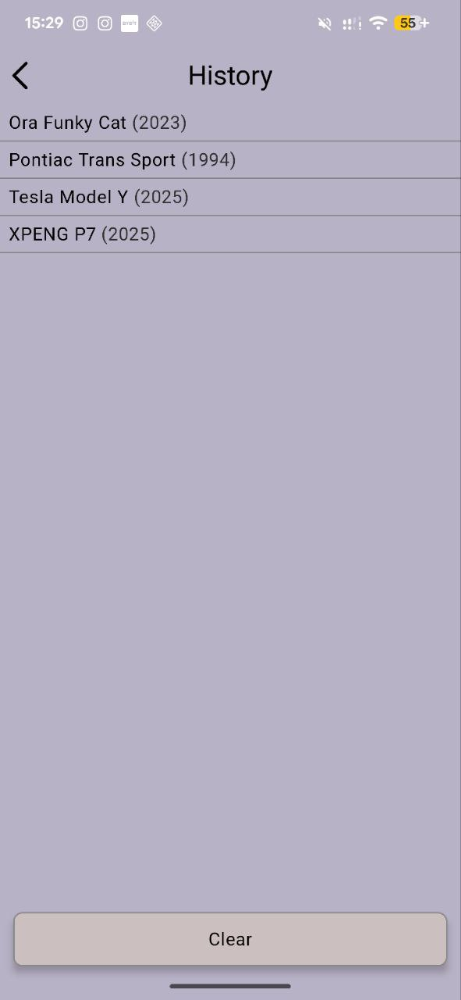
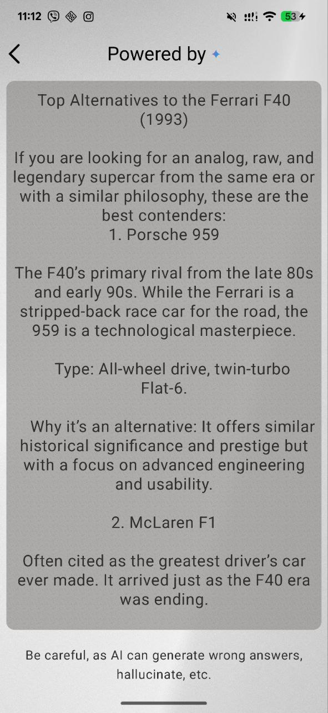

The application is written in Kotlin and built using a multi-module architecture, ensuring clear separation of responsibilities and scalability.

It follows the MVI architectural pattern, providing predictable state management and a unidirectional data flow. 

Dependency injection is implemented with Hilt, enabling easy management of dependencies across modules. 

Gemini API used for a lot of functionalities in the app, such as comparison of choices, etc.

Room was added for caching history of choices.

The app uses the latest Jetpack Navigation libraries, offering modern and type-safe navigation between screens.

The project also includes unit and instrumented tests, ensuring reliability and maintainability.

